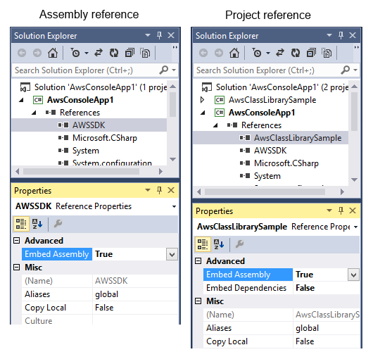

# Vitevic Assembly Embedder

Vitevic Assembly Embedder allows merging any referenced assembly into the main assembly as embedded resource. Using this tool you can seriously simplify your deployment process.

## Features

* Fully integrates to Visual Studio (2010, 2012, 2013, 2015, 2017) and MSBuild (see screenshots below).
* Works for libraries and WPF applications.
* You can specify what references you would like to embed.
* Correctly handles signed assemblies.
* Supports 2 references types:
  * Assembly Reference (reference to a 3-d party dll)
  * Project Reference (a reference to a library project in the same solution). Plus, it can automatically detect all the library project dependencies and embed them too.
* Uses a well known technique: embedding assemblies as resources within the main assembly and intercepting assembly load events (via AppDomain.AssemblyResolve event). This is done using a little-known feature of the CLR called a Module Initializer which is guaranteed to run before any other code. See more:
    > Excerpt #2 from CLR via C#, Third Edition
      "Module Initializer" (a.k.a Module Constructor)
* Visual Studio just modifies the project file:

    ```xml
    <Reference Include="AWSSDK">
        <HintPath>..\..\AWS SDK for .NET\bin\Net35\AWSSDK.dll</HintPath>
        <Private>False</Private>
        <EmbedAssembly>true</EmbedAssembly>
    </Reference>
    ```

And embedding is done during MSBuild process.



## Changelog

### Version 1.0.3 New Features

Visual Studio 2017 support. If you have several 2017 versions (Community and Enterprise, for example), the latest install of the highest version will be used during installation.

### Version 1.0.2 New Features

Visual Studio 2015 support (including Community edition).
Resolved assemblies cache.

### Version 1.0.1 New Features

Assembly Embedder MSBuild extensions can be installed separately on any build server like TFS or TeamCity.

Limitations in this version:

* Supports only managed assemblies (except Portable Class Libraries)
* No VB.NET support
